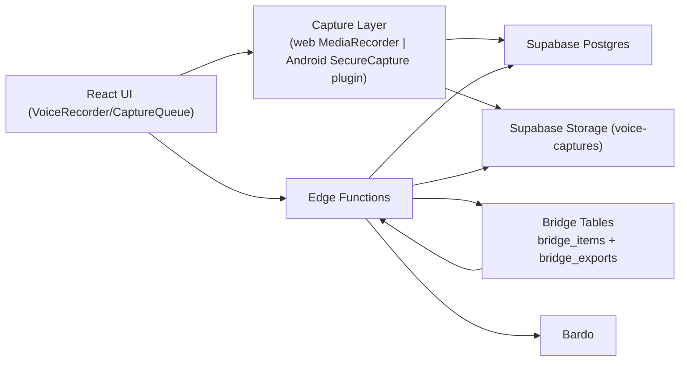

# VoiceIdeas System Architecture Deep Dive

## 1) Stack e topologia
- Frontend: React 19 + Vite + TypeScript
- Mobile shell: Capacitor (Android/iOS)
- Desktop shell historico: Tauri (artefatos ainda presentes)
- Backend: Supabase (Postgres + Storage + Edge Functions)
- Integracao externa: bridge para Bardo (v1, escopo controlado)

Fluxo simplificado:

## 2) Frontend por modulo

### 2.1 Roteamento principal
Arquivo: `src/App.tsx`
- Rotas principais:
- `/` Home
- `/capture-queue`
- `/idea-drafts`
- `/notes`
- `/organized`
- `/settings`
- `/admin`
- `/accept-invite`

### 2.2 Gravacao e captura
Arquivos centrais:
- `src/components/VoiceRecorder.tsx`
- `src/hooks/useSafeCaptureMode.ts`
- `src/hooks/mobile/useMobileAudioCapture.ts`
- `src/hooks/mobile/useMobileCaptureSession.ts`
- `src/utils/platform/audioCaptureCapabilities.ts`

Tres caminhos de captura coexistem:
- Manual (gravar/transcrever)
- Continuous (speech controller continuo)
- Safe Capture (modo robusto com pipeline de sessao)

Regra atual de plataforma:
- Android: usa `android-secure-capture` quando disponivel.
- iOS: usa `capacitor-native-recorder` com `requiresForeground=true`.
- Web: fallback via `MediaRecorder`.

### 2.3 Fila de captura e pipeline de ideias
Arquivo chave: `src/pages/CaptureQueue.tsx`
- Opera sessao/chunks/transcricao/materializacao.
- Acao "Separar ideias" chama service de segmentacao.
- Export bridge aparece em paineis especificos de nota/ideia consolidada.

## 3) Backend e services do frontend

### 3.1 Services do cliente
- `src/services/captureSessionService.ts`
- `src/services/transcriptionQueueService.ts`
- `src/services/bridgeExportService.ts`
- `src/lib/functionAuth.ts` (cabecalhos auth + refresh)
- `src/services/serviceAuth.ts` (validacao de usuario autenticado)

### 3.2 Functions Supabase relevantes
Pasta: `supabase/functions`

Core pipeline:
- `ingest-capture-session`
- `segment-audio-session`
- `transcribe-chunk`
- `materialize-idea`
- `delete-audio-chunk`
- `delete-capture-session`

Bridge:
- `bridge-items` (catalogo consultavel autenticado)
- `export-to-cenax` (exportacao efetiva, incluindo bardo)
- `bridge-exports` (endpoint legado com shared secret)

Auth nas functions:
- `verify_jwt=false` no config
- autenticacao aplicada manualmente por `_shared/auth.ts`
- frontend envia `Authorization: Bearer <jwt>` + `apikey`

## 4) Modelo de dados (partes criticas)

### 4.1 Pipeline de captura
- `capture_sessions`
- `audio_chunks`
- `transcription_jobs`
- `idea_drafts`
- `notes`
- `organized_ideas`

### 4.2 Bridge (modelo correto atual)
- `bridge_items`: catalogo de itens elegiveis para consumo
- `bridge_exports`: historico de tentativas/envios

Ligacao:
- `bridge_exports.bridge_item_id -> bridge_items.id`

Status importantes:
- `bridge_items.bridge_status`: `draft|eligible|published|consumed|blocked`
- `bridge_items.validation_status`: `valid|blocked`
- `bridge_exports.status`: `pending|exporting|exported|failed`

## 5) Bridge canonico vs bridge legado (muito importante)

### 5.1 Caminho canonico (manter)
- `export-to-cenax` + `_shared/bridge-export.ts` + `_shared/bridge-items.ts`
- Gera payload `voiceideas.bridge-export.v1`
- Sincroniza/atualiza `bridge_items`
- Cria eventos em `bridge_exports`
- Aplica gate de elegibilidade por safe_capture consolidada

### 5.2 Caminho legado (planejar aposentadoria)
- `src/lib/bridgeExport.ts`
- `src/components/SendToBardoModal.tsx`
- `supabase/functions/bridge-exports/index.ts` (usa campos legado)

Problema:
- legado ainda referencia shape antigo (`owner_email`, `content_hash`) e semantica antiga.
- nao deve ser fonte principal para evolucao da bridge v1.

## 6) Decisoes de produto/arquitetura que ja estao fixadas
- iOS foreground-first, sem prometer captura continua em lock screen.
- Android: captura precisa pertencer ao nativo, nao ao estado de UI.
- Bridge v1 minima: focar `note` e `organized_idea` de origem `safe_capture`.
- `bridge_items` e `bridge_exports` coexistem com papeis distintos.

## 7) Pontos que quem assumir deve decidir cedo
1. Desligar definitivamente o caminho legado de bridge no frontend.
2. Consolidar um unico endpoint de consumo para Bardo:
- ou manter `bridge-items` + `export-to-cenax` + RPCs
- ou manter `bridge-exports` como facade de consumo
3. Endurecer contratos de tipo em `src/types/bridge.ts` (hoje mistura legado + novo).
